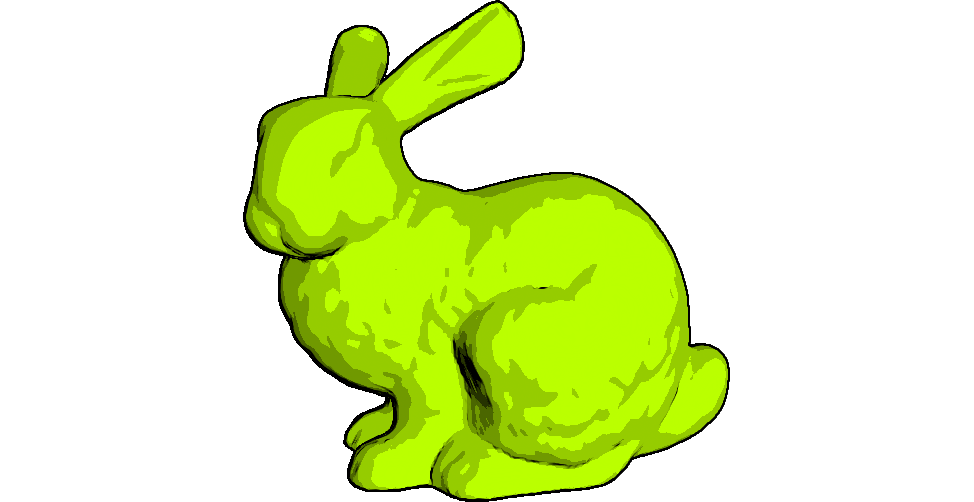

# Project - Computer graphics (1TD388/1MD150)

The deadline for the project and further instructions about what you need hand in to pass are available on the course page in Studium.

## Project 1 - Ray tracing

The aim of this project is to implement CPU-based ray tracing for global illumination.

Initial code for the project is available here on GitHub. To clone the repository, run (from the command line)

    git clone https://github.com/cg-uu/rt_viewer.git

Your main reference for this project will be the book "Ray Tracing in One Weekend" [Shirley 2016]  (see link to Ebook below). The code skeleton that you are given loosly follows the code structure of the book and contains an incomplete CPU-based ray tracer that you need to modify and extend. OpenGL is only used to display the ray traced image and render a GUI for setting parameters. To pass the project, you need to complete the following tasks:

- Implement anti-aliasing by adding per-sample jitter to the camera rays.
- Implement rendering of diffuse surfaces by tracing secondary ray for each camera ray hitting a surface. The light source should be a hemisphere light (the sky) and your ray tracing should support at least three random bounces.
- Add a few more spheres and more surface types to your scene. You should implement at least the metallic (reflective) material from the book. The glass material for refractive surfaces is optional. If you have time, feel free to add other materials as well, such as glossy or emissive surfaces.
- Add an ImGUI window for controlling rendering parameters such as material properties, anti-aliasing, number of bounces, etc. It should also be possible to display the surface normals and toggle gamma correction on/off. Note that gamma correction in the code is performed by the fragment shader used to display the ray traced image.
- When all the above is implemented and work correctly: add one of the provided low-polygon meshes (or some other mesh of similary complexity) to your scene. You will notice that the rendering becomes very slow... To improve this, compute and store the bounding box of the mesh and add a bounding volume test (sphere or box) to the tracing step. Notice the speedup (for example, how long it takes for the progress bar to reach 10%).

References:

- [Ray Tracing in One Weekend (HTML version)](https://raytracing.github.io/books/RayTracingInOneWeekend.html) Free Ebook about ray tracing. After you are done with all the tasks, you might want to check out the other books in the series, "Ray Tracing: The Next Week" and "Ray Tracing: The Rest of Your Life" :)
- [Ray Tracing in One Weekend (older PDF version)](http://www.realtimerendering.com/raytracing/Ray%20Tracing%20in%20a%20Weekend.pdf) The code examples in the "live" HTML version have been updated a bit since 2019 (to use double-precision floats and more modern C++ language features) so you might find the exampels in the older PDF version easier to adapt to the style of the project code.
- [Disney's Practical Guide to Path Tracing](https://www.youtube.com/watch?v=frLwRLS_ZR0) Short but informative introduction to path tracing from Disney/Pixar.
- [The Rendering Equation](https://studentportalen.uu.se/uusp-webapp/auth_hitch/spring/webpagefiles/files/download/646956/9be0692b-0b6e-4309-b429-14eff7a4f811.pdf) Kajiya's original research paper on path tracing from 1986.
- [Physically Based Rendering](http://www.pbr-book.org/) This book covers more advanced topics, and is also freely available on the book webpage.

## Project 2 - Free project

Here you have more freedom to select a rendering topic of your own interest. Unlike the ray tracing project, you will not be provided a ready source code framework. Instead, you will extend your model viewer from [Assignment 3](https://github.com/cg-uu/cg_assignment3).

To pass the project, you need to complete at least the following tasks:

- Add at least one or more of the rendering techniques suggested below to your model viewer. You can look at online tutorials for inspiration, but you are not allowed to extend or take tutorial code and hand in that as your solution!
- Your solution must include render-to-texture in some form, so you need to read up on how to set up framebuffer objects (FBOs) with multiple attachments (colors and depth). 
- Add an ImGui GUI for tweaking the rendering parameters and toggling on/off different steps/effects in the rendering.

Note: Each point listed below is a separate project. You only have to select and implement one of them! You are also free to propose other project topics than the ones suggested below.

## Lighting and global illumination

- Deferred shading: https://en.wikipedia.org/wiki/Deferred_shading. Render your scene to geometry buffers (G-buffers) in a first pass, and apply normalized Blinn-Phong shading in a second deferred pass.

- Screen-space ambient occlusion (SSAO): http://en.wikipedia.org/wiki/Screen_space_ambient_occlusion. Render depth and normals of your scene to textures, and compute ambient occlusion from that information and apply it to the ambient term when computing the lighting. Note: can be fairly difficult to implement, so you might want to discuss it with us first!

## Post-processing effects and non-photorealistic rendering

- Depth-of-field: https://developer.nvidia.com/gpugems/GPUGems/gpugems_ch23.html. Apply depth-of-field (DOF) computed from color and depth textures as a post-processing effect, and add sliders for lens properties like aperture and focal depth in the GUI.

- Toon shading: http://developer.amd.com/wordpress/media/2012/10/ShaderX_NPR.pdf. Draw scene with color quantization and outlines (like in the example image above) that you compute from depth, normal, and color textures.
